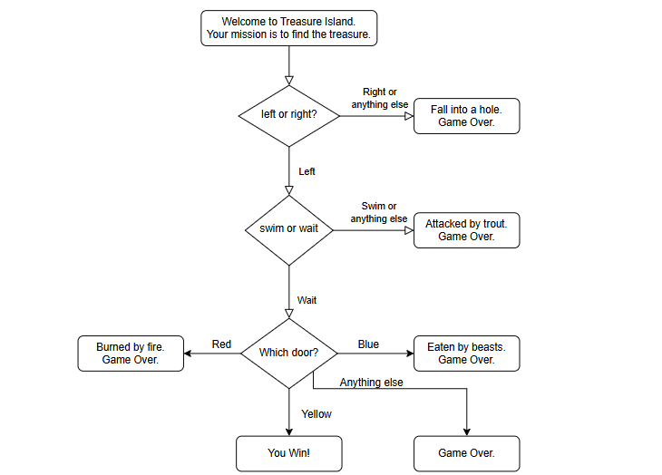
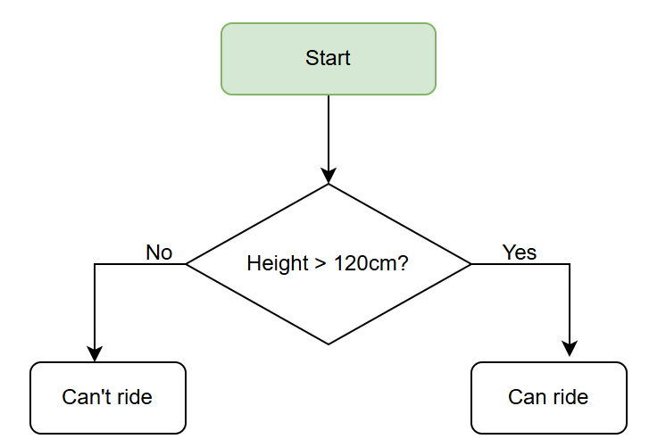
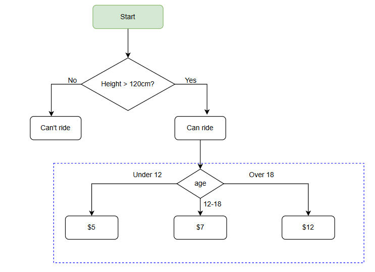
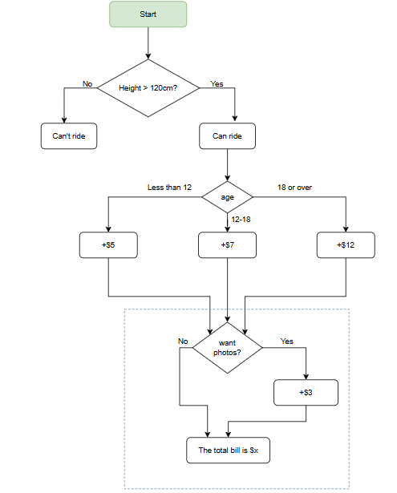
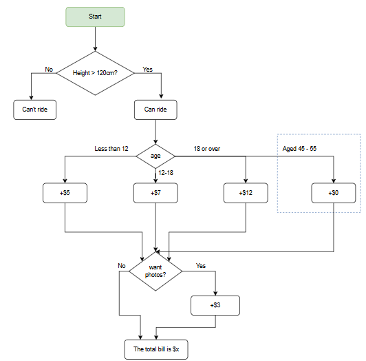

# Assignment: If/Else, Nested If/Else, and Loops Control Flow Practice

## Beginner Level - Game-Based Learning

---

## **PART 1: TREASURE ISLAND ADVENTURE GAME**

### If/Else Decision Making + While Loop

Text-based adventure games use decision trees to create branching storylines. Each choice leads to different outcomes. This teaches sequential decision-making, if/else logic, and how a `while` loop lets the player replay the game.



### Game Flow (Based on Flowchart)

```
Welcome to Treasure Island!
Your mission is to find the treasure.

Decision 1: left or right?
  → If Left → continue to Decision 2
  → If Right or anything else → "Fall into a hole. Game Over."

Decision 2 (only if Left): swim or wait?
  → If Wait → continue to Decision 3
  → If Swim or anything else → "Attacked by trout. Game Over."

Decision 3 (only if Wait): Which door? (red / blue / yellow)
  → If Red → "Burned by fire. Game Over."
  → If Blue → "Eaten by beasts. Game Over."
  → If Yellow → "You Win!"
  → Anything else → "Game Over."

After each round → Ask "Play again? (yes/no)"
  → If yes → the while loop goes back to the start
  → If no → exit the loop and end the program
```

### Assignment Requirements

Create a text-based adventure game that:

1. Uses a **`while` loop** as the outer loop so the player can replay the game
2. Inside the loop, welcomes the player and sets the scene
3. Asks **"Do you go left or right?"**
   - If `"left"` → continue to the next question
   - If `"right"` or anything else → print the game over message and end this round
4. Asks **"Do you swim or wait?"** (only if they chose left)
   - If `"wait"` → continue to the next question
   - If `"swim"` or anything else → print the game over message and end this round
5. Asks **"Which door do you choose? (red/blue/yellow)"** (only if they chose wait)
   - `"red"` → burned by fire. Game Over.
   - `"blue"` → eaten by beasts. Game Over.
   - `"yellow"` → You Win!
   - Anything else → Game Over.
6. After each round, asks **"Play again? (yes/no)"**
   - `"yes"` → the `while` loop repeats from the beginning
   - `"no"` → `break` out of the loop and print a goodbye message
7. All inputs must be **case-insensitive** — use `.lower()`

### Sample Output (Win then Quit)

```
=== WELCOME TO TREASURE ISLAND ===
Your mission is to find the treasure.

You are on a beach with a strange island ahead. You see a path splitting into two directions.

Do you go left or right? left
You go left. The path opens to a river.

Do you swim or wait? wait
You wait by the river. Suddenly, you hear mysterious sounds...

A cave reveals three doors: one glowing red, one deep blue, one bright yellow.
Which door do you choose? (red/blue/yellow) yellow

⭐ CONGRATULATIONS! ⭐
You found the treasure and escaped the island!
=== GAME OVER ===

Play again? (yes/no) no
Thanks for playing! Goodbye!
```

### Sample Output (Game Over Scenario)

```
=== WELCOME TO TREASURE ISLAND ===
Your mission is to find the treasure.

Do you go left or right? right
You fall into a hole!
Game Over. Try again!

Play again? (yes/no) yes

=== WELCOME TO TREASURE ISLAND ===
...
```

### Hints

- Use `input()` to get player choices
- Use `.lower()` to convert input to lowercase for easier comparison
- Use `while True:` with `break` to control the replay loop
- Use `if-elif-else` statements inside the loop for the decisions
- Use `continue` or `if/else` nesting to skip later decisions when the player already lost

---

## **PART 2: Rollercoaster Pricing System - 4 Stages**

## **OVERVIEW: The Four Stages**

This assignment takes you through four progressive stages of building a rollercoaster ticket booking system. Each stage adds more complexity using nested if/else statements **and `while` loops**.

| Stage       | Focus                          | New Features                            |
| ----------- | ------------------------------ | --------------------------------------- |
| **Stage 0** | Basic If/Else + While Loop     | Height validation with input loop       |
| **Stage 1** | Nested If/Else + While Loops   | Height loop + Age-based pricing loop    |
| **Stage 2** | Complex Nesting + While Loops  | Height + Age + Photo add-on loop        |
| **Stage 3** | Advanced Nesting + While Loops | Height + Age + Photos + Senior discount |

---

## **STAGE 0: HEIGHT CHECK ONLY**

### Basic If/Else + While Loop

### Flowchart Logic



```
Start
  ↓
While input is not a valid number → keep asking for height
  ↓
Height > 120cm?
  ├─ No → "Can't ride"
  └─ Yes → "Can ride"
```

### Theme Park Overview

Theme parks first check if a rider meets the minimum height requirement for safety reasons. Before checking height, the program must make sure the user typed a real number — this is where a `while` loop is required.

### Assignment Requirements

Create a program that:

1. Uses a **`while` loop** to keep asking for height until the user types a valid number
   - If the user types letters or leaves it empty → print an error and ask again
   - Once a valid number is received → exit the loop using `break`
2. Converts the input to an integer
3. Checks height:
   - If height is **120cm or less** → print "Can't ride" + a safety message
   - If height is **more than 120cm** → print "Can ride" + an encouraging message

### Sample Output (Valid Input — Can Ride)

```
=== ROLLERCOASTER BOOKING ===
What is your height (in cm)? abc
Invalid input! Please enter a number.
What is your height (in cm)? 145
✓ Great! You can ride this rollercoaster!
```

### Sample Output (Valid Input — Can't Ride)

```
=== ROLLERCOASTER BOOKING ===
What is your height (in cm)? 110
✗ Sorry, you are too short to ride.
Minimum height required: 120cm
```

### Key Concepts

- **`while True` loop** — keeps asking until valid input is given
- **`isdigit()`** — checks if the string is a whole number before converting
- **`break`** — exits the loop once valid input is received
- Simple `if/else` with comparison operator (`>`)

---

## **STAGE 1: HEIGHT + AGE-BASED PRICING**

### Introduction to Nested If/Else + Two While Loops

### Flowchart Logic



```
Start
  ↓
While height input is invalid → keep asking
  ↓
Height > 120cm?
  ├─ No → "Can't ride"
  └─ Yes → "Can ride"
            ↓
          While age input is invalid → keep asking
            ↓
          Age?
          ├─ Under 12 → $5
          ├─ 12-18 → $7
          └─ Over 18 → $12
```

### Theme Park Overview

Once the height requirement is met, the system checks age to determine the correct ticket price. Both height and age are collected inside `while` loops to prevent the program from crashing on bad input.

### Assignment Requirements

Building on Stage 0, add:

1. Use a **`while` loop** to validate height input (same as Stage 0)
2. If height passes, use a **second `while` loop** to validate age input
   - If the user types letters → print an error and ask again
   - Once valid → exit the loop with `break`
3. Determine price based on age (as shown in the flowchart):
   - Age under 12 → $5
   - Age 12–18 → $7
   - Age over 18 → $12
4. Display the age group and ticket price

### Sample Output (Child)

```
=== ROLLERCOASTER BOOKING ===
What is your height (in cm)? 130
✓ Great! You can ride this rollercoaster!

How old are you? 10
Age group: Child (Under 12)
Ticket price: $5
```

### Sample Output (Teenager — invalid age attempt)

```
=== ROLLERCOASTER BOOKING ===
What is your height (in cm)? 145
✓ Great! You can ride this rollercoaster!

How old are you? seventeen
Invalid input! Please enter a number.
How old are you? 16
Age group: Teenager (12-18)
Ticket price: $7
```

### Sample Output (Adult)

```
=== ROLLERCOASTER BOOKING ===
What is your height (in cm)? 175
✓ Great! You can ride this rollercoaster!

How old are you? 28
Age group: Adult (18+)
Ticket price: $12
```

### Key Concepts

- **Two `while` loops** — one for height, one for age, each validates separately
- **First level of nesting** — if inside if
- **`elif` statements** — for multiple age price conditions
- **`break`** — exits each validation loop on valid input

---

## **STAGE 2: HEIGHT + AGE + PHOTO ADD-ONS**

### Complex Nested If/Else + Three While Loops

### Flowchart Logic



```
Start
  ↓
While height input is invalid → keep asking
  ↓
Height > 120cm?
  ├─ No → "Can't ride"
  └─ Yes → "Can ride"
            ↓
          While age input is invalid → keep asking
            ↓
          Age?
          ├─ Less than 12 → +$5
          ├─ 12-18 → +$7
          └─ 18 or over → +$12
            ↓
          While photo input is not "yes" or "no" → keep asking
            ↓
          Want photos?
          ├─ No → total = base price
          └─ Yes → total = base price + $3
            ↓
          Display: "The total bill is $x"
```

### Theme Park Overview

Theme parks offer optional photo packages. A `while` loop ensures the customer **must** type exactly `"yes"` or `"no"` — no other value is accepted.

### Assignment Requirements

Building on Stage 1, add:

1. All Stage 1 requirements (`while` loops for height and age)
2. Use a **third `while` loop** to ask **"Do you want to buy photos? (yes/no)"**
   - Keep asking until the user types `"yes"` or `"no"` (case-insensitive)
   - Any other input → print an error and ask again
3. If `"yes"` → add $3 to the base ticket price
4. Display itemized bill:
   - Base ticket price
   - Photo cost (if any)
   - Total cost

### Sample Output (Without Photos)

```
=== ROLLERCOASTER BOOKING ===
What is your height (in cm)? 140
✓ Great! You can ride this rollercoaster!

How old are you? 14
Age group: Teenager (12-18)
Base ticket price: $7

Do you want to buy photos? (yes/no) maybe
Please type 'yes' or 'no'.
Do you want to buy photos? (yes/no) no

==== YOUR BILL ====
Ticket: $7
Photos: $0
────────────
Total: $7
```

### Sample Output (With Photos)

```
=== ROLLERCOASTER BOOKING ===
What is your height (in cm)? 155
✓ Great! You can ride this rollercoaster!

How old are you? 8
Age group: Child (Under 12)
Base ticket price: $5

Do you want to buy photos? (yes/no) yes

==== YOUR BILL ====
Ticket: $5
Photos: +$3
────────────
Total: $8
```

### Key Concepts

- **Three `while` loops** — height, age, and photo choice, each with its own validation
- **Two levels of nesting** — if within if within if
- **`.lower()`** — for case-insensitive comparison of `"yes"` / `"no"`
- **`photo_cost`** — initialize to `0` before the photo loop

---

## **STAGE 3: COMPLETE SYSTEM WITH SENIOR DISCOUNT**

### Advanced Nested If/Else + Three While Loops with Special Cases

### Flowchart Logic



```
Start
  ↓
While height input is invalid → keep asking
  ↓
Height > 120cm?
  ├─ No → "Can't ride"
  └─ Yes → "Can ride"
            ↓
          While age input is invalid → keep asking
            ↓
          Age?
          ├─ Less than 12 → +$5
          ├─ 12-18 → +$7
          ├─ 18 or over → +$12
          └─ Aged 45-55 (Senior) → +$0 ⭐ SPECIAL
            ↓
          While photo input is not "yes" or "no" → keep asking
            ↓
          Want photos?
          ├─ No → total = base price
          └─ Yes → total = base price + $3
            ↓
          Display: "The total bill is $x"
```

### Theme Park Overview

Many theme parks offer special senior discounts for ages 45–55. All three inputs (height, age, photo choice) are protected by `while` loops so the program never crashes and always gets the correct data.

### Assignment Requirements

Building on Stage 2, add:

1. All Stage 2 requirements (three `while` loops for height, age, photos)
2. Add a **senior special case** inside the age `if/elif` chain:
   - Ages 45–55 → **FREE RIDE ($0)**
   - This check must appear **before** the `age > 18` check in your `elif` chain
   - Seniors can still buy photos for +$3
3. Display a special celebration message for seniors
4. Show full itemized bill

### Sample Output (Senior with Photos)

```
=== ROLLERCOASTER BOOKING ===
What is your height (in cm)? 160
✓ Great! You can ride this rollercoaster!

How old are you? 50
Age group: Senior (45-55)
🎉 SPECIAL DISCOUNT! 🎉
Your ride is completely FREE!

Do you want to buy photos? (yes/no) yes

==== YOUR BILL ====
Ticket: $0 (Senior Discount!)
Photos: +$3
────────────
Total: $3
Thank you for celebrating with us!
```

### Sample Output (Senior without Photos)

```
=== ROLLERCOASTER BOOKING ===
What is your height (in cm)? 162
✓ Great! You can ride this rollercoaster!

How old are you? 48
Age group: Senior (45-55)
🎉 SPECIAL DISCOUNT! 🎉
Your ride is completely FREE!

Do you want to buy photos? (yes/no) no

==== YOUR BILL ====
Ticket: $0 (Senior Discount!)
Photos: $0
────────────
Total: $0
Thank you for celebrating with us!
```

### Sample Output (Regular Adult with Photos)

```
=== ROLLERCOASTER BOOKING ===
What is your height (in cm)? 170
✓ Great! You can ride this rollercoaster!

How old are you? 35
Age group: Adult (18+)
Ticket price: $12

Do you want to buy photos? (yes/no) yes

==== YOUR BILL ====
Ticket: $12
Photos: +$3
────────────
Total: $15
```

### Key Concepts

- **Three `while` loops** — one for each input (height, age, photo)
- **Range checking in `elif`** — `45 <= age <= 55` for senior check
- **Order matters** — senior `elif` must come **before** the `age > 18` `elif`
- **Special message** — display a celebration message for seniors only

---

## **PROGRESSION CHALLENGE: COMBINING ALL STAGES**

### Complete Interactive System with Loops

Once you have completed all four stages individually, create a **complete system** that:

1. Uses an **outer `while` loop** to process multiple customers one by one
2. Uses **inner `while` loops** to validate every input (height, age, photos, and "continue?")
3. Uses a **`for` loop** at the end to print a formatted summary report
4. Tracks these statistics in variables during the `while` loop:
   - Total customers processed
   - Total revenue collected
   - Number of seniors who rode free
   - Number of photo packages sold
5. After the outer loop ends, displays a final session summary

### Complete System Sample Output

```
=== ROLLERCOASTER BOOKING SYSTEM ===
Welcome to the ultimate theme park experience!

Customer 1
──────────
What is your height (in cm)? 135
✓ Great! You can ride this rollercoaster!

How old are you? 10
Age group: Child (Under 12)
Ticket price: $5

Do you want to buy photos? (yes/no) yes

==== YOUR BILL ====
Ticket: $5
Photos: +$3
────────────
Total: $8

Process another customer? (yes/no) yes

Customer 2
──────────
What is your height (in cm)? 165
✓ Great! You can ride this rollercoaster!

How old are you? 50
Age group: Senior (45-55)
🎉 SPECIAL DISCOUNT! 🎉
Your ride is completely FREE!

Do you want to buy photos? (yes/no) no

==== YOUR BILL ====
Ticket: $0 (Senior Discount!)
Photos: $0
────────────
Total: $0
Thank you for celebrating with us!

Process another customer? (yes/no) no

=== SESSION SUMMARY ===
Total Customers Processed: 2
Total Revenue: $8
Photo Packages Sold: 1
Senior Free Rides: 1
Average Revenue per Customer: $4.00
Thank you for visiting!
```

### Hints for the Challenge

- Use `customer_count = 0` and increment it at the start of every loop iteration
- Use a `while True:` loop with `break` for the "Process another customer?" question
- Use a `for` loop over a list of tuples to print the summary neatly
- Use `if customer_count > 0:` before calculating the average to avoid dividing by zero

---

## **PRACTICE PROGRESSION CHECKLIST**

- [ ] **Stage 0**: Write height check with `while` loop for input validation
- [ ] **Stage 1**: Add age pricing + second `while` loop for age validation
- [ ] **Stage 2**: Add photo option + third `while` loop for photo input validation
- [ ] **Stage 3**: Add senior discount — make sure its `elif` comes before `age > 18`
- [ ] **Part 1**: Treasure Island with outer `while` for replay and inner decisions using `if/else`
- [ ] **Challenge**: Complete multi-customer system — `while` for customers, `for` for summary
- [ ] **Extra**: Test every invalid input scenario to confirm your loops work correctly

---

## **Debugging Tips**

❌ **Problem**: `while` loop runs forever and never stops

✅ **Solution**: Make sure you have a `break` inside the loop that triggers on valid input.

---

❌ **Problem**: Senior discount not working

✅ **Solution**: The `elif 45 <= age <= 55:` check must come **BEFORE** `elif age > 18:` in your chain.

---

❌ **Problem**: Photos not adding to total

✅ **Solution**: Initialize `photo_cost = 0` before the photo `while` loop so it always has a value.

---

❌ **Problem**: Program crashes when user types letters for height or age

✅ **Solution**: Use a `while True:` loop with `isdigit()` to check the input BEFORE converting it to `int()`.

---

❌ **Problem**: "Syntax Error: invalid syntax"

✅ **Solution**: Check your indentation! Python requires consistent indentation inside loops and if blocks.

---

## **Learning Path Summary**

**Stage 0**: Learn basic `if/else` + your first `while` loop for input validation

→ **Stage 1**: Learn nested `if/else` + two `while` loops (height and age)

→ **Stage 2**: Learn deeper nesting + three `while` loops (add photo validation)

→ **Stage 3**: Learn complex conditions and senior range check + all three `while` loops

→ **Part 1**: Learn outer `while` for replay + inner `if/else` for game decisions

→ **Challenge**: Combine everything — outer `while` for customers, inner `while` loops for inputs, `for` loop for the session summary

**Congratulations!** By completing all stages, you will have mastered:

✅ Simple `if/else` statements

✅ Nested `if/else` logic

✅ `elif` chains and conditions

✅ Range checking with `and` / `<=`

✅ `while True` loops with `break` for input validation

✅ Outer `while` loops for program flow control

✅ `for` loops for iterating over lists

✅ Real-world application design
